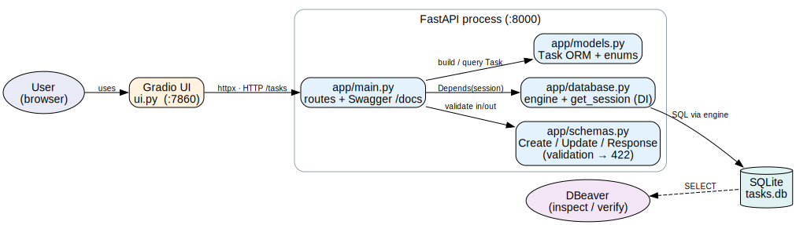
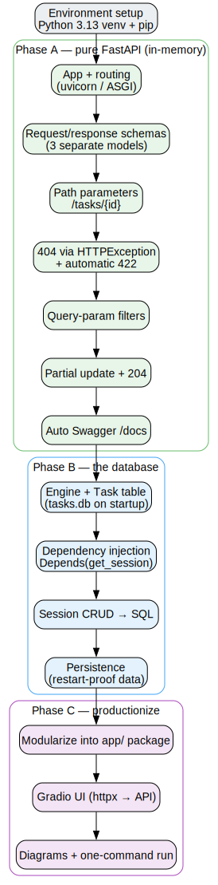

# Task Tracker API

A small REST API to manage tasks, with a Gradio web UI. It runs two ways:

- **Locally** with Python — backed by a file-based **SQLite** database.
- **Containerized** with Docker Compose — backed by a real **PostgreSQL** container.

The same application code powers both; only the `DATABASE_URL` differs.

**Stack:** FastAPI · SQLModel · Uvicorn · Gradio · SQLite / PostgreSQL · Docker · Docker Compose

## Architecture



The Gradio UI is a separate process that talks to the FastAPI service **over
HTTP** (via `httpx`) — it never touches the database directly. FastAPI handles
validation and routing; SQLModel maps Python objects to SQL. When running with
Docker Compose there are three containers — `api`, `ui`, and `db` (Postgres) —
on one private network.

## Features

- Full CRUD for tasks (`create` / `list` / `read` / `update` / `delete`)
- Filtering the list by `status` and `priority` via query params
- Separate request/response schemas (`TaskCreate`, `TaskUpdate`, `TaskResponse`)
- Database session via dependency injection (`Depends(get_session)`)
- Proper error handling: `404` for missing tasks, automatic `422` for invalid input
- Auto-generated Swagger UI at `/docs`
- Gradio UI for creating / listing / updating / deleting tasks
- Runs on SQLite locally or PostgreSQL in containers — no code change

## Project structure

```
app/
  __init__.py
  database.py   engine, get_session (DI), create_db_and_tables, env-driven DATABASE_URL
  models.py     Task table model + Status/Priority enums
  schemas.py    TaskCreate / TaskUpdate / TaskResponse
  main.py       FastAPI app, lifespan, the 5 CRUD routes
ui.py           Gradio client (calls the API over HTTP)
run.sh          one-command local launcher (API + UI, SQLite)
Dockerfile      multi-stage image for the api + ui services
docker-compose.yml   the 3-service stack (api + ui + Postgres)
requirements.txt     runtime dependencies installed into the image
.dockerignore        keeps the build context lean
.env.example         template for the Postgres credentials (copy to .env)
docs/DOCKER.md       deeper explanation of the Docker setup
docs/           architecture & learning-flow diagrams (+ generator script)
```

## Data model

A `Task` has:

| Field         | Type                                     | Notes                        |
|---------------|------------------------------------------|------------------------------|
| `id`          | int                                      | primary key, auto-assigned   |
| `title`       | str                                      | required                     |
| `description` | str \| null                              | optional                     |
| `status`      | enum: `pending` / `in_progress` / `done` | defaults to `pending`        |
| `priority`    | enum: `low` / `medium` / `high`          | defaults to `medium`         |
| `created_at`  | datetime                                 | set by the server on create  |

---

## Run with Docker (containerized — recommended)

This is the easiest way to run everything: one command starts the API, the UI,
and a PostgreSQL database in three connected containers. No Python, virtualenv,
or local Postgres install needed — only Docker.

### Prerequisites

- **Docker Desktop** installed and running (`docker --version` should work).
  Docker Compose is included with Docker Desktop.

### 1. Create your environment file

Credentials are read from a `.env` file (which is gitignored, so secrets never
get committed). Copy the template and adjust if you like:

```bash
cp .env.example .env
```

`.env` sets the Postgres user, password, database name, and the host port:

```
POSTGRES_USER=taskuser
POSTGRES_PASSWORD=taskpass
POSTGRES_DB=tasks
POSTGRES_PORT=5432
```

### 2. Build and start the whole stack

```bash
docker compose up --build
```

This builds the image, then starts all three services in order (it waits for
Postgres to be healthy before starting the API). Add `-d` to run in the
background. First run downloads base images, so it takes a minute or two.

Once it's up:

- **API + Swagger UI:** http://localhost:8000/docs
- **Gradio UI:** http://localhost:7860
- **PostgreSQL:** `localhost:5432` (for DBeaver — see below)

### 3. Stop it

```bash
docker compose down       # stop & remove containers, KEEP the database data
docker compose down -v     # ALSO delete the database data (fresh start)
```

Your task data lives in a named volume (`pgdata`), so it survives `down` and
rebuilds. Only `down -v` wipes it.

### Useful commands

```bash
docker compose ps                  # status + health of each service
docker compose logs -f api         # follow the API logs
docker compose exec db psql -U taskuser -d tasks   # a SQL shell in the db container
docker compose up --build -d       # rebuild and restart in the background
```

### How the services connect

Inside Compose, services reach each other **by service name**, not `localhost`:

- The API connects to Postgres with `DATABASE_URL=postgresql://...@db:5432/tasks`
  (the host is `db`, the service name).
- The UI reaches the API with `API_URL=http://api:8000`.

For a full, beginner-friendly explanation of the Dockerfile and Compose file
(images vs containers, volumes, healthchecks, networking), see
[`docs/DOCKER.md`](docs/DOCKER.md).

---

## Run locally with Python (SQLite)

Requires Python 3.12+. Good for quick local development without Docker.

```bash
python3 -m venv .venv
source .venv/bin/activate
pip install --upgrade pip
pip install "fastapi[standard]" sqlmodel gradio graphviz
```

Then start both services with one command (stops both on `Ctrl-C`):

```bash
./run.sh
```

- API + Swagger UI: http://127.0.0.1:8000/docs
- Gradio UI:        http://127.0.0.1:7860

A `tasks.db` SQLite file is created in the project directory on first startup.
(The app defaults to SQLite; Docker Compose overrides `DATABASE_URL` to use
Postgres instead.)

---

## Endpoints

| Method | Path            | Description                                        |
|--------|-----------------|----------------------------------------------------|
| POST   | `/tasks`        | Create a task                                      |
| GET    | `/tasks`        | List tasks (optional `?status=` and `?priority=`)  |
| GET    | `/tasks/{id}`   | Get one task (404 if missing)                      |
| PUT    | `/tasks/{id}`   | Partial update (send only the fields to change)    |
| DELETE | `/tasks/{id}`   | Delete a task (204 No Content)                     |

### Examples

```bash
curl -X POST http://localhost:8000/tasks \
  -H 'Content-Type: application/json' \
  -d '{"title":"Write the API","priority":"high"}'

curl "http://localhost:8000/tasks?status=pending&priority=high"

curl -X PUT http://localhost:8000/tasks/1 \
  -H 'Content-Type: application/json' -d '{"status":"done"}'

curl -X DELETE http://localhost:8000/tasks/1
```

## Where are the SQL queries?

There are no hand-written SQL strings — SQLModel/SQLAlchemy **generates** the SQL
from the ORM calls (`session.add`/`commit`, `select(Task).where(...)`,
`session.get`, `session.delete`). To **see** the generated SQL, set `SQL_ECHO=1`:

```bash
SQL_ECHO=1 ./run.sh                      # local
# or, in docker-compose.yml, add SQL_ECHO=1 to the api service's environment
```

Every `INSERT` / `SELECT` / `UPDATE` / `DELETE` statement then prints to the
console as it runs.

## Verify the database with DBeaver

DBeaver lets you inspect the database directly, so you can confirm the API's
writes really land in it.

**Containerized (PostgreSQL):**

1. Make sure the stack is running (`docker compose up`).
2. *New Database Connection* → **PostgreSQL**.
3. Host `localhost`, Port = your `POSTGRES_PORT` (default `5432`), Database
   `tasks`, Username `taskuser`, Password `taskpass` (your `.env` values) →
   *Finish*.
4. Expand *Databases → tasks → Schemas → public → Tables → task → Data*.

> **Port already in use?** If you have a native Postgres running on your machine
> it will occupy host port `5432` and shadow the container (you'll see
> `FATAL: role "taskuser" does not exist`). Set `POSTGRES_PORT=5433` in `.env`,
> run `docker compose up -d`, and connect DBeaver to port `5433` instead.

**Local (SQLite):**

1. *New Database Connection* → **SQLite** → point it at the `tasks.db` file in
   this project directory → *Finish*.
2. Expand *Tables → task → Data*.

Either way: create / update / delete tasks from the Gradio UI (or `/docs`), then
**Refresh** (F5) the Data tab and confirm the rows really change — don't rely on
the HTTP `200` alone.

## Learning flow

How this project was built, concept by concept:



Diagrams are generated by `docs/generate_diagrams.py` (needs `brew install
graphviz`): `python docs/generate_diagrams.py`.
</content>
